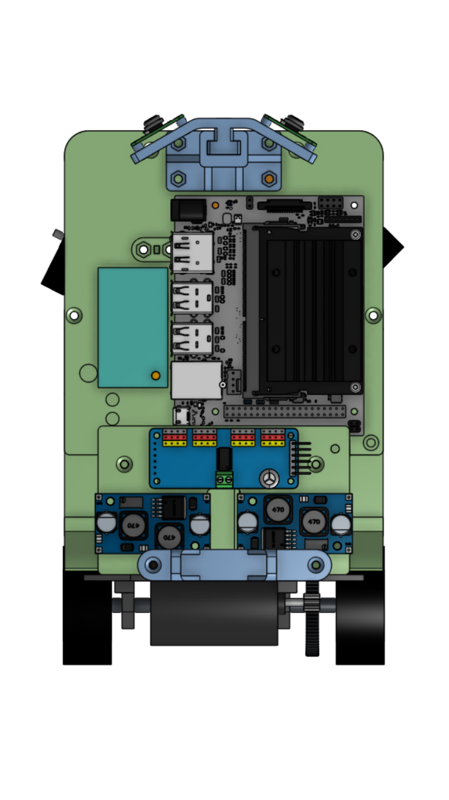
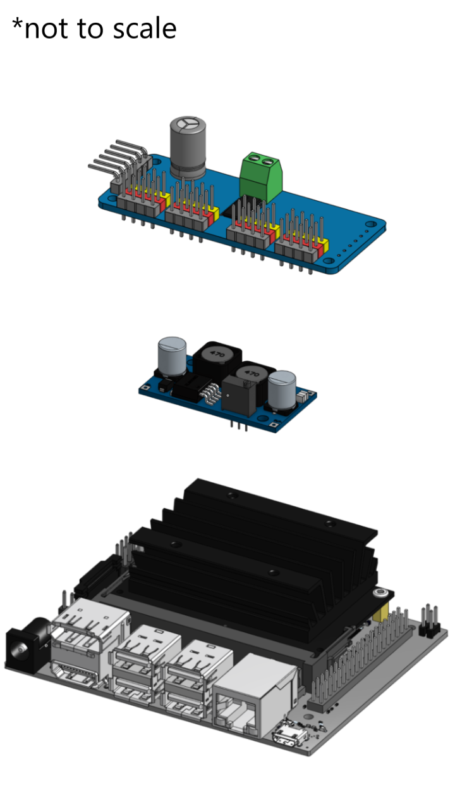
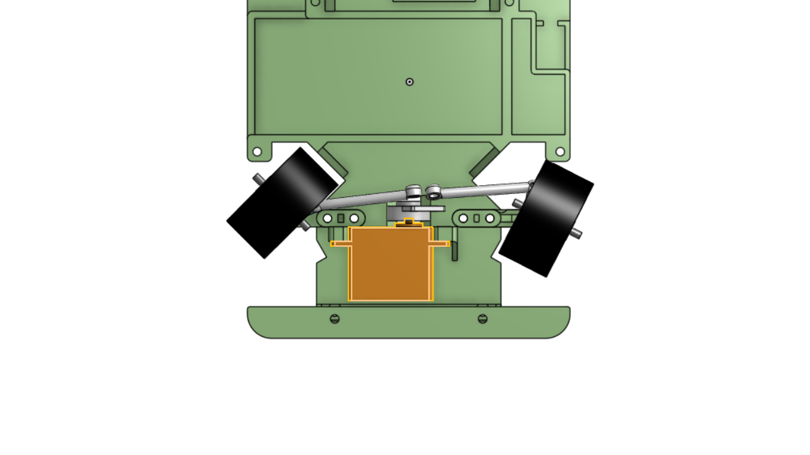
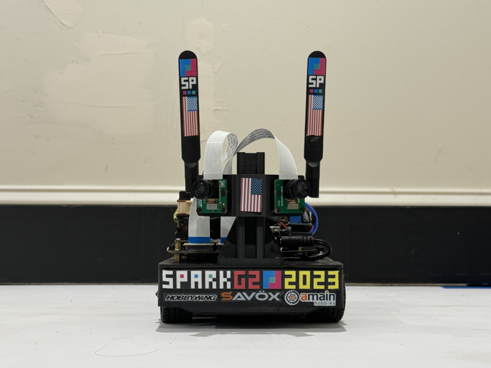
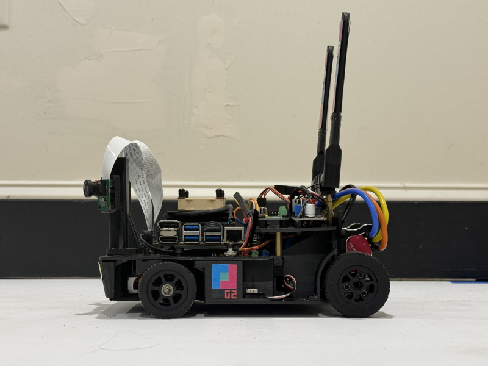
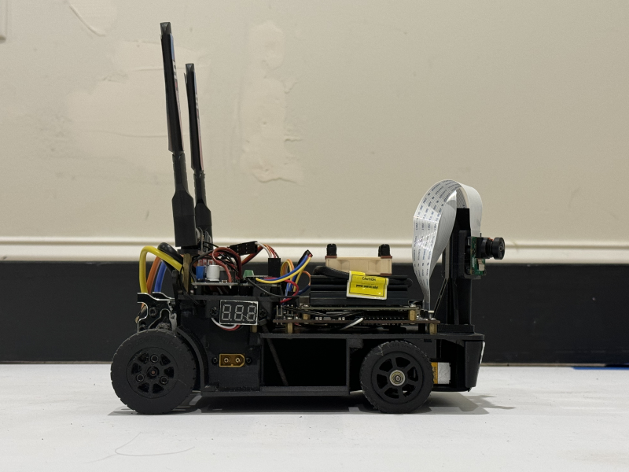
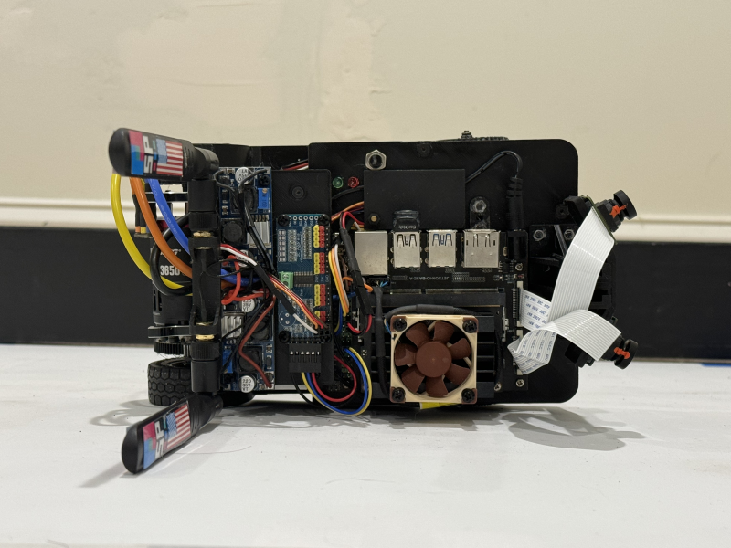
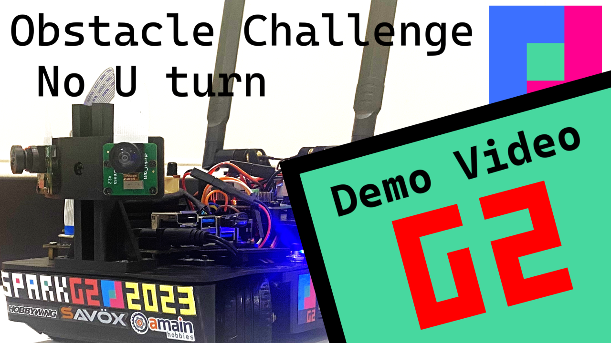
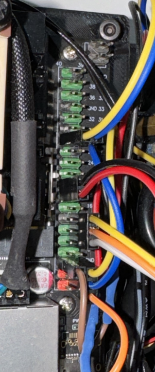

<div align=center>


</div>

***

**Official GitHub repository for WRO USA Future Engineers team SPARK 2023. All code, documentation, and files are located here.**

***

# Contents
* [**Hardware Design**](#hardware-design)
    * [Chassis](#chassis)
    * [Power & Control](#power--control)
    * [Motors](#motors)
    * [Sensors](#sensors)
    * [Wiring Diagram](#wiring-diagram)
* [**Software Design**](#software-design)
* [**Photos**](#photos)
* [**In-depth Algorithm Documentation**](ALGORITHM.md)
* [**Build & Setup**](#build--setup)
    * [Parts List](#parts-list)
    * [Important Assembly Notes](#important-assembly-notes)
    * [Jetson Nano Setup](#jetson-nano-setup)
        * [General Information](#general-jetson-nano-information)
        * [OS Installation](#os-installation)
        * [SSHFS & Static IP](#sshfs--static-ip)
        * [GPIO & I2C](#enable-gpio-and-i2c)
        * [Package Installation](#package-installation)
        * [Calibration](#calibration)
        * [Running Programs](#running-programs)
* [**Demonstration Videos**](#demonstration-videos)
* [**Team Photos**](#team-photos)
* [**SPARK Utilities**](#spark-utilities)
    * [SPARK Control Panel](#spark-control-panel)
        * [Map View](#map-view)
        * [Changing Parameters](#changing-parameters)
    * [SPARK Randomizer](#spark-randomizer)
    * [Setup](#spark-utility-setup)
* [**Lessons Learned**](#lessons-learned)
* [**LiPo Battery Safety Notice**](#lipo-battery-safety-notice)

***

# Hardware Design

SPARK G2 consists of a 3D-printed chassis with off-the-shelf components mounted to it, like the motors, cameras, and controller boards. For a full component list, see [SETUP.md](./SETUP.md#parts-list). CAD models can be found in `/dist/3d-models/`, and have all been [modeled in Onshape here](https://cad.onshape.com/documents/82dd14d30b814e8846567203/w/34e1b6a4058ed5fbde8ef66a/e/47aa4028e09ec17a24a63590).


***

## Chassis

The chassis consists of a lower base with vertical walls to mount the rear axle and upper platforms. It has space for the battery and an ESC (electronic speed controller) bay in the rear, and a compartment in the front for the steering mechanism. The rear axle is sourced from the Atom 2 GT12 pan car kit by Schumacher, and is mounted vertically to save space.

The electronics platforms sit on top of the chassis base, and the main platform is also a structural component that provides rigidity to the chassis. Because the electronics are on top, they are easily accessible and wiring is fairly simple. The only exceptions are the ESC, which is in the rear, and the IMU (inertial measurement unit, used for measuring angles and velocity).

| Chassis base with rear axle and steering           | Chassis base and platforms, without camera tower            |
| -------------------------------------------------- | ----------------------------------------------------------- |
|  |  |

The wheels are made of 3D-printed rims with LEGO tires, and the front steering linkage is a custom design with an exaggerated [Ackerman steering geometry](https://en.wikipedia.org/wiki/Ackermann_steering_geometry). (This can be seen in the [Motors section](#motors))

## Power & Control

The vehicle power is supplied by a single 3s LiPo battery, running at 12 Volts. This 12V power is run into three components in parallel: The ESC, 5V regulator, and 7.4V regulator. The regulators ensure that the Jetson Nano and servo do not get damaged from overvoltage, and the ESC can run directly off of the main 12V line.

The Jetson Nano uses an intermediate PWM control board to control the drive and steering motors. The control board and Nano communicate through I2C, and that is converted to a PWM signal for the motors to interpret. The drive motor has an additional speed controller.

| Top-down view of SPARK G2 in Onshape            | Individual components                                         |
| ----------------------------------------------- | ------------------------------------------------------------- |
|  |    |
| Front of vehicle at top                         | (top-to-bottom) - PWM Driver, Voltage regulator, Jetson Nano |

## Motors

SPARK is rear wheel drive, with a sensored brushless drive motor and high-quality servo from Savox. The drive motor is controlled by the brushless ESC (electronic speed controller), and has a sensor. Brushless motors allow for finer control at low speed, and the addition of a sensor helps too.

It still would be better to use a lower kV motor (a slower motor) with an [ODrive](https://odriverobotics.com/) and encoder for even better low-speed control, but the current setup is sufficient.

We choose to use the Savox SV1260MG for our steering servo because of its speed - with transit times of under 100ms, this servo would not limit our control of the vehicle. It can also run at higher voltages, meaning we can get more power out of it.

| Drive motor                                    | Servo and steering                                           |
| ---------------------------------------------- | ------------------------------------------------------------ |
|  |  |

## Sensors

One major physical change is the addition of a second IMX219 wide-angle camera to the front of the car. Both cameras are angled 30 degrees to either side, with a field of view of 150 degrees for each camera. The cameras are mounted on a slider to ensure the accuracy of the [distance calculations in the algorithm](./ALGORITHM.md#merge-contours--wall-lines).


In addition to the two wide-angle cameras, SPARK G2 has an IMU (inertial measurement unit) for measuring the angle of the vehicle. It also has the capability to measure linear acceleration, but we don't use that. It communicates over I2C directly with the Jetson Nano.

SPARK G2 does not use any other sensors to percieve its environment - no LiDAR here!

## Wiring Diagram


***

# Software Design

[**For a detailed explaination of the SPARK G2 algorithms, see Algorithm.md!**](ALGORITHM.md)

## [Obstacle Management Algorithm](ALGORITHM.md)

* [**Image Processing**](ALGORITHM.md#image-processing)
    1. [Crop the image](ALGORITHM.md#crop-the-image)
    2. [Undistort](ALGORITHM.md#undistorting)
    3. [Filter](ALGORITHM.md#filtering)
    4. [Find wall heights](ALGORITHM.md#finding-wall-heights)
    5. [Find contours](ALGORITHM.md#finding-contours)
    6. [Find wall lines](ALGORITHM.md#finding-wall-lines)
    7. [Merge & Convert wall lines and contours](ALGORITHM.md#merge-contours--wall-lines)
    8. [Categorize Walls](ALGORITHM.md#categorizing-walls)
    9. [Find Car Orientation](ALGORITHM.md#finding-car-orientation)
    10. [Filter Traffic Signals/Obstacles/Pillars/Game Objects](ALGORITHM.md#filtering-traffic-signals)
* [**Steering and Motion Planning**](ALGORITHM.md#steering-and-motion-planning)
    1. [Find Lap Direction](ALGORITHM.md#finding-lap-direction)
    2. [Calculate Steering](ALGORITHM.md#calculating-steering)

## Pseudo Code

The algorithm part of the code is a loop. Each iteration, it takes images, processes them, and then calculates a steering value.

Each iteration takes about 80ms.

```
while (sections entered != 24): # 24 sections means 3 laps.
    // Image processing for car localization
    Crop the images
    Undistort the images (how to add links to other files?)
    Filter the image
    Find wall heights
    Find contours
    Find wall lines
    Merge & Convert wall lines and contours
    Categorize Walls
    Find Car Orientation
    Filter Pillars
    <!--Car steering control-->
    Find lap direction
    Calculate Steering
```

***

# Photos

*(Click to view detail)*

|                                                                               |                                                                               |
| ----------------------------------------------------------------------------- | ----------------------------------------------------------------------------- |
| [](./img/docs/view-front.png)     | [](./img/docs/view-back.png)     |
| [](./img/docs/view-left.png) | [](./img/docs/view-right.png) |
| [](./img/docs/view-top.png)       | [](./img/docs/view-bottom.png)    |

***

# Demonstration Videos

| Open Challenge                                                                                                                                       | Obstacle Challenge (no U-turn)                                                                                                                                                    | Obstacle Challenge (U-turn)                                                                                                                                                 |
| ---------------------------------------------------------------------------------------------------------------------------------------------------- | --------------------------------------------------------------------------------------------------------------------------------------------------------------------------------- | --------------------------------------------------------------------------------------------------------------------------------------------------------------------------- |
| [](https://youtu.be/1Tk8J1Zt5vI) | [](https://youtu.be/uySmueLLGK8) | [](https://youtu.be/UDNGXfyl8ww) |

***

# Build & Setup

**This section is a walkthrough of the build process and setup of the controller, a Jetson Nano.**

***

You will need (at least) the following tools:
* 3D printer or access to 3D printing service
* Hex Allen drivers (key or bits)
* Phillips head drivers
* Crimping kit
* Soldering iron

***

## Parts:

* At least 0.8kg PLA filament
* Parts from [Schumacher Atom 2 S2 1/12 GT12 Competition Pan Car Kit](https://www.amainhobbies.com/schumacher-atom-2-s2-1-12-gt12-competition-pan-car-kit-schk179/p1055346) (not sponsored)
    * [Drive Pod Parts](https://www.racing-cars.com/gt12/atom-2/atom-2-parts=chassis-parts/s2-pod-parts-atom-2-u7905?returnurl=%2fgt12%2fatom-2%2fatom-2-parts%3dchassis-parts%2f)
    * [Assembled Differential](https://www.racing-cars.com/gt12/atom-2/atom-2-parts=transmission/assembled-diff-atom-2-u7713?returnurl=%2fgt12%2fatom-2%2fatom-2-parts%3dtransmission%2f)
    * [Left Drive Wheel Clamp](https://www.racing-cars.com/gt12/atom-2/atom-2-parts=transmission/lh-drive-clamp-a1-a2-u4853?returnurl=%2fgt12%2fatom-2%2fatom-2-parts%3dtransmission%2f)
    * Transmission Housings: [Left Side](https://www.racing-cars.com/gt12/atom-2/atom-2-parts=transmission/trans-housing-lh-a2-3-e2-e5-u7483?returnurl=%2fgt12%2fatom-2%2fatom-2-parts%3dtransmission%2f), [Right Side](https://www.racing-cars.com/gt12/atom-2/atom-2-parts=transmission/trans-housing-rh-a2-3-e2-e3-e4-u7484?returnurl=%2fgt12%2fatom-2%2fatom-2-parts%3dtransmission%2f)
    * [Ride Height Adjusters](https://www.racing-cars.com/gt12/atom-2/atom-2-parts=suspension/ride-height-adjusters-0-25-1-75-4prs-e1-5-ic-2-a3-u4973?returnurl=%2fgt12%2fatom-2%2fatom-2-parts%3dsuspension%2f) (use 1.75mm)
    * 2x [LP Front Axle](https://www.racing-cars.com/gt12/atom-2/atom-2-parts=suspension/low-profile-front-axle-a1-a3-u7302?returnurl=%2fgt12%2fatom-2%2fatom-2-parts%3dsuspension%2f)
    * [Rear Axle Ball Bearings](https://www.racing-cars.com/gt12/atom-2/ball-bearing-1-4x3-8x1-8-flanged-yellow-pr-u4980?returnurl=%2fgt12%2fatom-2%2f)
    * [Front Axle Ball Bearings](https://www.racing-cars.com/gt12/atom-2/ball-bearing-1-8x5-16-flanged-yellow-pr-u4981?returnurl=%2fgt12%2fatom-2%2f)
    * [Steel shims](https://www.racing-cars.com/gt12/atom-2/s-steel-shims-1-4x5-16x0-004-ss-at-ecl-u4112?returnurl=%2fgt12%2fatom-2%2f%3fcount%3d96)
    * [M3 Nyloc Nuts](https://www.racing-cars.com/gt12/atom-2/m3-alloy-nyloc-nuts-low-profile-black-pk10-cr517?returnurl=%2fgt12%2fatom-2%2f)
    * [Servo Horn](https://www.racing-cars.com/gt12/atom-2/atom-2-parts=chassis-parts/25t-servo-saver-assembly-a2-e3-e4-u7895?returnurl=%2fgt12%2fatom-2%2fatom-2-parts%3dchassis-parts%2f)
    * [Ball Studs (short)](https://www.racing-cars.com/gt12/atom-2/pro-ball-stud-short-pk4-u4274?returnurl=%2fgt12%2fatom-2%2f)
* [Yahboom Jetson Nano 4GB Developer Kit](https://category.yahboom.net/collections/jetson/products/jetson-nano-sub)
* 2x [Arducam Raspberry Pi Official Camera Module V2, with 8 Megapixel IMX219 Wide Angle 175 Degree Replacement](https://www.amazon.com/Arducam-Raspberry-Official-Megapixel-Replacement/dp/B083PW4BLH/)
* [Intel AX201 WiFi 6 BT 5.1 M.2 2230 with 10in RP-SMA Antenna](https://www.newegg.com/p/0XM-009Y-001C7) (not required but helpful)
* [Noctua NF-A4x10 5V](https://noctua.at/en/products/fan/nf-a4x10-5v) (not required)
* [Adafruit MPU-6050 6-DoF Accelerometer & Gyroscope Sensor (with STEMMA QT connector)](https://www.adafruit.com/product/3886)
* [PCA9685 16 Channel PWM Driver](https://www.amazon.com/HiLetgo-PCA9685-Channel-12-Bit-Arduino/dp/B01D1D0CX2)
* [HobbyWing QUICRUN 10BL60 Brushless ESC Sensored](https://www.hobbywingdirect.com/products/quicrun-10-sensored)
* [HobbyWing QUICRUN 3650 Sensored Brushless Motor G2 (25.5T)](https://www.hobbywingdirect.com/collections/quicrun-brushless-motor-series-sensorless/products/quicrun-3650-sensored-2-pole-brushless-motor?variant=28166803089)
* [Savox SV1260MG Digital Mini Servo](https://www.savoxusa.com/products/savsv1260mg-mini-digital-high-voltage)
* A LiPo balance charger with XT-60 connector, rated for 3S
* [Zeee Premium Series 3S LiPo Battery 4200mAh 11.4V 120C with XT60 Plug](https://www.amazon.com/Zeee-Premium-Compatible-Helicopter-Airplane/dp/B09CMLSK67)
* 2x [XL4015E1 DC-DC 5A Adjustable Buck Converter](https://www.amazon.com/Adjustable-Converter-1-25-36v-Efficiency-Regulator/dp/B079N9BFZC)
* [DC Digital Voltometer](https://www.amazon.com/bayite-Digital-Voltmeter-Display-Motorcycle/dp/B00YALUXH0/)
* [Male 5.5mm DC Barrel Connectors](https://www.amazon.com/Pigtails-Female-Connector-Pigtail-Security/dp/B08PYWN3T7/)
* [Panel-Mountable Female XT60 Connectors](https://www.amazon.com/XT60E-M-Mountable-Connector-Models-Multicopter/dp/B07YJMCDC3)
* [Normally Closed/Momentary On Push Button](https://www.amazon.com/Pieces-normally-closed-Button-Momentary/dp/B07HCLVMGS/) (size must match)
* [12 Tooth 48 Pitch Pinion Gear with Set Screw](https://www.amazon.com/Traxxas-PINION-PITCH-SCREW-2428/dp/B00EFXMUO2)
* [78 Tooth Spur Gear 48 Pitch](https://www.amazon.com/Kimbrough-Pitch-Spur-Gear-78T/dp/B0006O1QVM)
* 16, 20 gauge wire
* M3 nylon screws (6mm)
* M3 nylon standoffs (6mm works best)
* M3 nylon nuts
* M3 nuts
* Countersunk, cap head M3 screws (6mm and 8mm work best)
* Socket cap head M3x40mm screws [(like these)](https://www.amazon.com/Alloy-Steel-Socket-Screws-Black/dp/B00W97R5KU)
* Differential lubrication

## Important Assembly Notes

If you need a reference model we have our [OnShape document linked](https://cad.onshape.com/documents/82dd14d30b814e8846567203/w/34e1b6a4058ed5fbde8ef66a/e/47aa4028e09ec17a24a63590). (The ESC and IMU have not been modeled. The ESC goes in the rear, within the raised rectangle. The IMU should be mounted to the 4 unpopulated holes with M2.5 screws.)

### [**We HIGHLY recommend that you visit this document!**](https://cad.onshape.com/documents/82dd14d30b814e8846567203/w/34e1b6a4058ed5fbde8ef66a/e/47aa4028e09ec17a24a63590)

Follow the diagram below to wire the button and indicator LEDs. *(Click to view detail)*

[](./img/docs/led-button-wiring.png)

*Note: For I2C connectors, Yellow should be SCL and blue should be SDA; there is no set standard.*

For soldering, we recommend soldering the regulators to their own connectors **in parallel**, and using that as a pass-through to the ESC. The female connectors should be used on the ESC inputs and regulator input, and the male connector on the pass through end of the regulator wires. See the diagram below.


Follow the quick start guide for the ESC to solder the motor connections. Brief summary: solder A, B, and C connectors to the motor (or supplied connectors). Ensure the sensor wire is secure before mounting motor and ESC.

**WARNING:** DO NOT CONNECT THE ESC 3-PIN DIRECTLY TO THE SERVO DRIVER! IT WILL BACKDRIVE THE REGULATOR AND BREAK IT! ONLY CONNECT THE PWM PIN (white)!

The images below show the correct pins on the Jetson Nano to plug the connectors onto. **Always double-check your connectors!**

 *(Click to view detail)*

| Pinout sheet                                                                                                                                              | Jetson Nano                                                            | PWM driver                                                                          |
| --------------------------------------------------------------------------------------------------------------------------------------------------------- | ------------------------------------------------------------------------------------ | ----------------------------------------------------------------------------------- |
| [](https://docs.google.com/spreadsheets/d/1WAe1DtCbWhLoC4L6yzJYvS99iHG4yAiWakqxsy8os7s/edit?usp=sharing) | [](./img/docs/pinout-1.png) | [](./img/docs/pinout-2.png) |


## Jetson Nano Setup

**This section is a walkthrough of the software environment setup.**

### General Jetson Nano Information

SPARK G2 is designed to run on a Jetson Nano with Ubuntu 18.04, with the Jetpack SDK installed. This means that Python should already be installed. The program is mainly written in Python, with some code in JavaScript for the SPARK Utilities.

Here are the most important subsections in this section:
* [General Information](#general-jetson-nano-information)
* [OS Installation](#os-installation)
* [Package Installation](#package-installation)
* [Running Programs](#running-programs)

### OS Installation

Visit [Yahboom](http://www.yahboom.net/)'s [setup and tutorial repository](http://www.yahboom.net/study/jetson-nano) to begin setting up the [Jetson Nano 4GB](https://category.yahboom.net/collections/jetson/products/jetson-nano-sub). Follow steps 1.1-1.7 in "Development setup > SUB Version".

> http://www.yahboom.net/study/jetson-nano <!-- not the right way to use markdown quote but oh well -->

This guide should install the default Ubuntu 18.04 with Jetpack SDK, with Python 3.6 pre-installed.

***

### SSHFS & Static IP

After setting up the board, follow step 2.1 in section "Basic Settings" to log into your Jetson Nano. **Keep PuTTY open**, as it will be used for the rest of the setup process. **Also keep the IP**.

Make sure a **static IP is set** to the board to make SSH and file transfer easier. Go to your router settings and [assign a DHCP reservation (PCmag)](https://www.pcmag.com/how-to/how-to-set-up-a-static-ip-address) (or a straight static IP) to your Jetson Nano. **Save this IP** in your PuTTY settings and SSHFS mounting.

For remote file transfer, install sshfs (linux only), or use [sshfs-win](https://github.com/winfsp/sshfs-win) from WinFsp. Follow instructions to mount the Jetson Nano to a network drive. Now upload all contents of the `/Program/` folder into a new folder on the Jetson Nano. **Remember the directory of the folder**, this will be used later.

***This method should be used to upload programs.***

**The *entire* `Program` directory must be uploaded in order for the program to run. Ensure the `path` constant in `startup.py` is defined properly.**

***

### Enable GPIO and I2C

The enable GPIO and I2C, create a new user group, and add your user to it.

```
sudo groupadd -f -r gpio
sudo usermod -a -G gpio your_user_name
```

Copy `99-gpio.rules` from `/dist/` in the project folder to `/etc/udev/rules.d/` on the Jetson Nano. Then enable the rule.

```
sudo udevadm control --reload-rules && sudo udevadm trigger
```

You may need to enable permissions for I2C

```
sudo usermod -a -G i2c your_user_name
```

**Reboot the Nano to apply changes.**

***

### Text-Only, Auto-Login, & Run on Startup

Switch the Jetson Nano to text-only mode (gui is almost useless for this application and only causes unneccesary slowness).

```
sudo systemctl set-default multi-user.target
```

Autologin must be done to avoid having to plug in a monitor and keyboard to start ssh and run programs. The following accomplishes it:

```
sudo systemctl edit getty@tty1
```

A temporary editor will appear. Place the following text in it, replacing "your_user_name" with your user name.

```
[Service]
ExecStart=
ExecStart=-/sbin/agetty -o '-p -f your_user_name' -a your_user_name --noclear %I $TERM
```

Save and close the editor with `:wqa`.

To run the program on startup, first obtain the directory of the program folder uploaded earlier. Create `spark_startup.service` in `/etc/systemd/system` and place the following in the contents, replacing "/filepath/" with the absolute directory of the folder (begins with a "/").

```
[Service]
WorkingDirectory=/filepath
ExecStart=/usr/bin/python3 -u /filepath/startup.py
User=username

[Install]
WantedBy=multi-user.target
```

Save the file and add permissions to it.

```
sudo chmod 644 /etc/systemd/system/spark_startup.service
systemctl enable /etc/systemd/system/spark_startup.service
```

If you wish to use the SPARK Control Panel, repeat the above steps to create a second startup service (`spark_server.service`). (Be sure to also install Node.js per the [package installation section](#package-installation)!) The contents should look like the below:

```
[Service]
WorkingDirectory=/filepath
ExecStart=/usr/bin/node /filepath/Util/server.js
User=username

[Install]
WantedBy=multi-user.target
```

Make sure to add the same permissions as `spark_startup.service`.

Reboot the Jetson Nano to test if these changes worked. No GUI should appear and you shuld be automatically logged in.

Enable run-on-startup by editing `run-on-startup.txt` in the folder. Replace the first line with `true`.

Go to `startup.py`, and change `path` to the absolute filepath of your directory (same as filepath in the previous steps)

Example:

```
path = '/home/nano/Documents/SPARK_FutureEngineers_2023/'
```

**Reboot the Jetson Nano again.**

***

### Package Installation

Some packages will need to be installed. [Jetson-GPIO](https://github.com/NVIDIA/jetson-gpio), socket.io-client, [adafruit-servokit](https://github.com/adafruit/Adafruit_CircuitPython_ServoKit), and [adafruit-mpu6050](https://github.com/adafruit/Adafruit_MPU6050) must be installed (Jetson-GPIO may be pre-installed on some versions). Additionally, [cv2](https://pypi.org/project/opencv-python/), an integral part of many robotics programs, must be installed.

Use the following pip command:

```
pip3 install adafruit-circuitpython-servokit adafruit-mpu6050 "python-socketio[client]" opencv-python
```

*Note: This may take a while.*

Additionally, [Node.js](https://nodejs.org/) should be installed to use the SPARK Control Panel. *We highly recommend this is done!*

```
sudo apt install nodejs
```

*NOTE: The default installation of node may be v12, which doesn't support some features. To install newer versions, try the following:*

```
sudo snap install node --channel=16 --classic
sudo update-alternatives --install /usr/bin/node node /snap/bin/node 0
```

*This should install Node.js v16 and set it to be the main version of node used with the "node" command.*

Navigate to `/Util/` and install dependencies.

```
npm install
```

***

### Calibration

You need to calibrate the cameras for the undistortion to work properly. To do this, you need to take a couple of images of a chessboard using the SPARK Control Panel. Delete all the images in `/images`, and paste the images you took. Now, you need to run the first program of `calibrate.py`. This should print out the required D and K matrix. Now you can paste these matrices into the second program. Look in the `output` folder and check the images to make sure the undistortion is working. There should be some black gaps on the top and bottom of the image, because undistorting the image stretches the corners. Make sure the lines on the chessboard are straight. Now you can paste the matrices into `converter.py` and it shoudl work.

You also need to calibrate the wall heights. Run the Control Panel and take a Filtered image. Open this image in Paint 3d. You need to split the image into 8ths manually and find how far down the walls are.

***

### Running Programs

To run a program, connect to the vehicle using PuTTY and navigate to the `/Program/` folder. Then, use one of the following two commands to run a program.

```
python3 manualdrive.py
python3 autodrive.py
```

`manualdrive.py` is a testing program that **requires** the SPARK Control Panel - it will crash if SPARK Utilities are not set up! Once started, go to the [SPARK Control Panel](#spark-control-panel) and your computer will automatically connect to the vehicle if configured. For more information, see the [section on the Control Panel](#spark-control-panel).

`autodrive.py` is the competition program. It can be run with the SPARK Utility server for debugging, but during competitions, or when testing without the server, can be run headless (without user interface). Simply add the flag `no_server` to disable the server. **This is how the program is run during competitions**

```
python3 autodrive.py no_server
```

***

# Team Photos

| Team Photo                          | the other thing                 |
| ----------------------------------- | ------------------------------- |
|  |  |

***

# SPARK Utilities

We (team SPARK) have created our own utilities to remotely command and monitor our robot from our own computers. 

**This section covers installing and using these utilities.**

***

## SPARK Control Panel

SPARK Control Panel is our own testing and debugging software. It allows us to log detailed information about the program's internal workings and present it in a graphical format. SPARK Utilities work wirelessly, so as long as the network is configured correctly ([setup instructions](#spark-utility-setup)) SPARK Control Panel can communicate with the robot.

<div align=center>


</div>

On the left side of the screen, there are controls and camera views. There are buttons to run programs at the top, along with the indicator LEDS that reflect the ones on the vehicle.

Below that, there are camera controls. There are options to view and save image streams or individual images, with filtering enabled. A recent addition allows you to also run the algorithm on frames from wherever.

At the bottom, there are options to toggle different displays on the Control Panel. Hover over them to get a description of their function.

There are also buttons to import and export sessions, as well as save a screenshot of the current frame from the cameras.

***

### Map View

The map on the right side of the screen is the most important addition to the SPARK Control Panel.

***

### Changing Parameters

<!-- pull from odl readme, shorten a bit and make more concise -->

***

## SPARK Randomizer

SPARK Randomizer is a tool to use when the card-drawing, coin-flipping, headache-inducing randomizing system is too slow. SPARK Randomizer generates valid cases (as long as the right button is clicked) according to the 2023 rules.

<div align=center>


</div>

## SPARK Utility Setup

SPARK Utilities run on a separate Node.js process and are not necessary. If you want access to the SPARK Control Panel you must install Node.js and dependencies.

**See [the package installation section](#package-installation) to install Node.js.**

For the authentication system to work properly (not actual authentication, just a UUID exchange to prevent people from sending bogus signals) `auth.json` must be created in `/Util/`.

```
vim auth.json
```

The contents should be a single UUID:

```
"214e7634-b7c3-4044-b297-533da8cfbe7f"
```

This UUID should also be present on client devices, along with the IP of the car (set earlier). On the client devices, create `/SPARK-Util/SPARK-Control/config.js`.

Example:

```
const ip = '192.168.1.151';
const auth_uuid = '214e7634-b7c3-4044-b297-533da8cfbe7f';
```

To open the SPARK Control Panel and other utilities, run `node SPARK-Util/static.js` on a local terminal (your computer) or open the batch file `/SPARK-Util/static.bat`. In a web browser (only Chrome tested), navigate to `localhost:8081` to access the SPARK Control Panel.

***

# Lessons Learned

* We learned that you need to use `numpy` or `cv2` for almost all the image processing, because python for loops are way too slow.
* We learned that simplicity is almost always better:
* We started by trying SLAM (Simultaneous Localization And Mapping) for our car, which turns out to be unneccessary for our purpose. So we instead switched to a simplified version, which keeps only a rough location and orientation of the vehicle. This turns out to be a good balance between speed and accuracy.
* We originally wanted to emulate a LiDAR using the cameras, generating a point cloud, and using SLAM and such, but directly undistorting the image instead of the points and using simpler image-based algorithms (like Hough lines) was easier and more efficient.
* We learned that sending too quickly oscillating inputs to the servo will cause it to stop responding, because of a built-in safety protection. We fixed this by adding input smoothing.
* We learned that keeping an XSS bug is not a good idea.

***

# LiPo Battery Safety Notice

While LiPo batteries are the safest form of portable, affordable, high density energy storage, there are still precautions to be taken when working with them. Lithium is a highly volatile element, and will react with the water vapor in the air if exposed to it.

1. **Do not** puncture, deform, short, or heat LiPo batteries above 26° C (80° F) (299.15 K)
2. Store and charge LiPos in a *fireproof container* **away** from flammable materials and water
3. **NEVER** charge a swollen or damaged battery (e.g. damaged leads, swelling of cells, puncture in wrapping)
4. **NEVER** leave a charging battery unattended
5. Only charge LiPo batteries with chargers *designed for LiPo batteries*
6. Dropping a battery can cause sufficient damage to rupture a cell and cause shorts
7. Overdischarging a LiPo battery can cause **permanent damage**

If a LiPo battery goes below its minimum voltage (stated in the manual included or 3.3v multiplied by the amount of cells connected in series) it can cause **permanent internal damage**. This damage is not visible until after further use, when it can swell, or potentially burst and **cause a FIRE**.

**Read all safety notes and instructions included with LiPo batteries before use.**

### For a more detailed LiPo safety manual there is one on [Tenergy Power](https://power.tenergy.com/lipo-safety-warnings/)