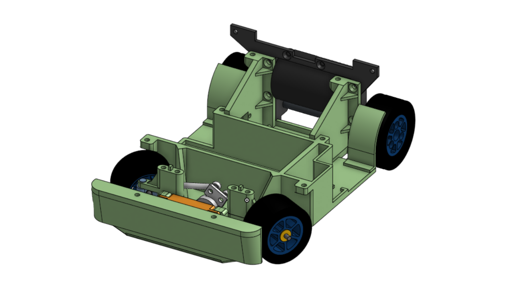
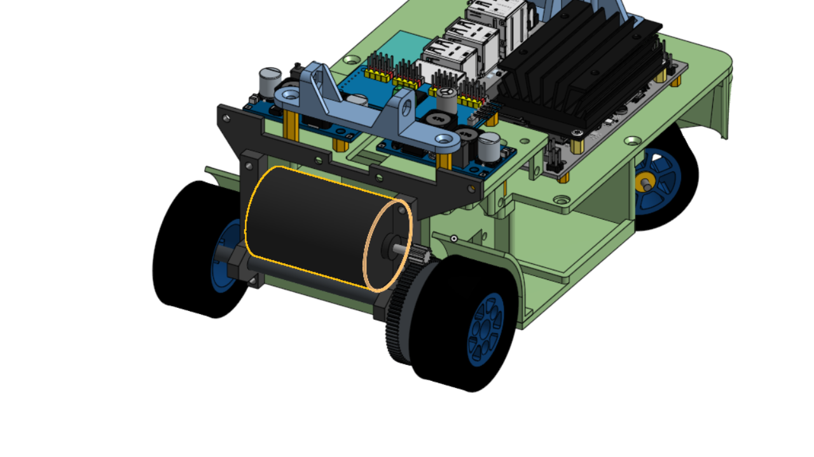
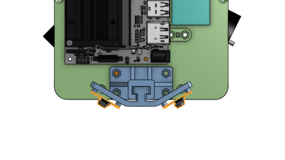
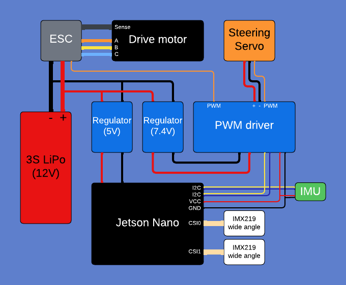
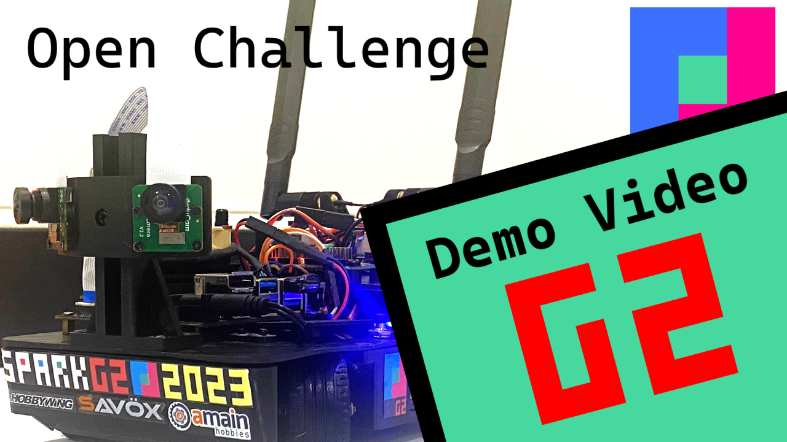
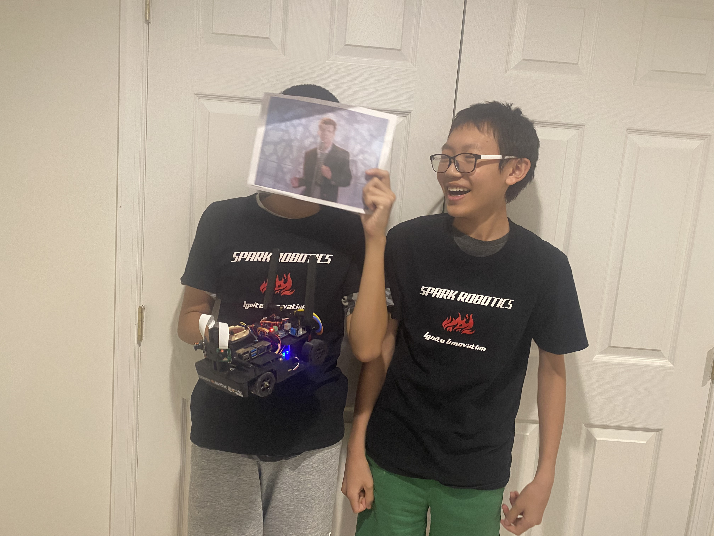
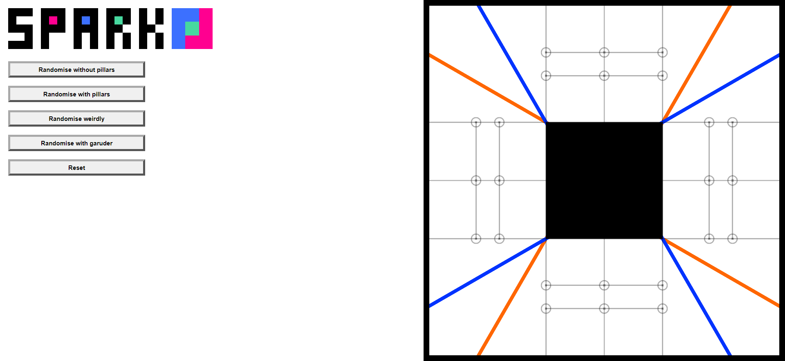

<div align=center>


</div>

***

**Official GitHub repository for WRO USA Future Engineers team SPARK 2023. All code, documentation, and files are located here.**

***

# Contents
* [**Hardware Design**](#hardware-design)
    * [Chassis](#chassis)
    * [Power & Control](#power--control)
    * [Motors](#motors)
    * [Sensors](#sensors)
    * [Wiring Diagram](#wiring-diagram)
* [**Software Design**](#software-design)
* [**Photos**](#photos)
* [**In-depth Algorithm Documentation**](ALGORITHM.md)
* [**Build & Setup**](#build--setup)
    * [Parts List](#parts-list)
    * [Important Assembly Notes](#important-assembly-notes)
    * [Jetson Nano Setup](#jetson-nano-setup)
        * [ohno]
* [**Demonstration Videos**](#demonstration-videos)
* [**Team Photos**](#team-photos)
* [**SPARK Utilities**](#spark-utilities)
    * [SPARK Control Panel](#spark-control-panel)
        * [Map View](#map-view)
        * [Changing Parameters](#changing-parameters)
    * [SPARK Randomizer](#spark-randomizer)
    * [Setup](#spark-utility-setup)
* [**Lessons Learned**](#lessons-learned)
* [**LiPo Battery Safety Notice**](#lipo-battery-safety-notice)

***

# Hardware Design

SPARK G2 consists of a 3D-printed chassis with off-the-shelf components mounted to it, like the motors, cameras, and controller boards. For a full component list, see [SETUP.md](./SETUP.md#parts-list). CAD models can be found in `/dist/3d-models/`, and have all been [modeled in Onshape here](https://cad.onshape.com/documents/82dd14d30b814e8846567203/w/34e1b6a4058ed5fbde8ef66a/e/47aa4028e09ec17a24a63590).


***

## Chassis

The chassis consists of a lower base with vertical walls to mount the rear axle and upper platforms. It has space for the battery and an ESC (electronic speed controller) bay in the rear, and a compartment in the front for the steering mechanism. The rear axle is sourced from the Atom 2 GT12 pan car kit by Schumacher, and is mounted vertically to save space.

The electronics platforms sit on top of the chassis base, and the main platform is also a structural component that provides rigidity to the chassis. Because the electronics are on top, they are easily accessible and wiring is fairly simple. The only exceptions are the ESC, which is in the rear, and the IMU (inertial measurement unit, used for measuring angles and velocity).

| Chassis base with rear axle and steering           | Chassis base and platforms, without camera tower            |
| -------------------------------------------------- | ----------------------------------------------------------- |
|  |  |

The wheels are made of 3D-printed rims with LEGO tires, and the front steering linkage is a custom design with an exaggerated [Ackerman steering geometry](https://en.wikipedia.org/wiki/Ackermann_steering_geometry). (This can be seen in the [Motors section](#motors))

## Power & Control

The vehicle power is supplied by a single 3s LiPo battery, running at 12 Volts. This 12V power is run into three components in parallel: The ESC, 5V regulator, and 7.4V regulator. The regulators ensure that the Jetson Nano and servo do not get damaged from overvoltage, and the ESC can run directly off of the main 12V line.

The Jetson Nano uses an intermediate PWM control board to control the drive and steering motors. The control board and Nano communicate through I2C, and that is converted to a PWM signal for the motors to interpret. The drive motor has an additional speed controller.

| Top-down view of SPARK G2 in Onshape            | Individual components                                         |
| ----------------------------------------------- | ------------------------------------------------------------- |
|  |    |
| Front of vehicle at top                         | (top-to-bottom) - PWM Driver, Voltage regulator, Jetson Nano |

## Motors

SPARK is rear wheel drive, with a sensored brushless drive motor and high-quality servo from Savox. The drive motor is controlled by the brushless ESC (electronic speed controller), and has a sensor. Brushless motors allow for finer control at low speed, and the addition of a sensor helps too.

It still would be better to use a lower kV motor (a slower motor) with an [ODrive](https://odriverobotics.com/) and encoder for even better low-speed control, but the current setup is sufficient.

We choose to use the Savox SV1260MG for our steering servo because of its speed - with transit times of under 100ms, this servo would not limit our control of the vehicle. It can also run at higher voltages, meaning we can get more power out of it.

| Drive motor                                    | Servo and steering                                           |
| ---------------------------------------------- | ------------------------------------------------------------ |
|  |  |

## Sensors

One major physical change is the addition of a second IMX219 wide-angle camera to the front of the car. Both cameras are angled 30 degrees to either side, with a field of view of 150 degrees for each camera. The cameras are mounted on a slider to ensure the accuracy of the [distance calculations in the algorithm](./ALGORITHM.md#merge-contours--wall-lines).



In addition to the two wide-angle cameras, SPARK G2 has an IMU (inertial measurement unit) for measuring the angle of the vehicle. It also has the capability to measure linear acceleration, but we don't use that. It communicates over I2C directly with the Jetson Nano.

SPARK G2 does not use any other sensors to percieve its environment - no LiDAR here!

## Wiring Diagram



***

# Software Design

[**For a detailed explaination of the SPARK G2 algorithms, see Algorithm.md!**](ALGORITHM.md)

## [Obstacle Management Algorithm](ALGORITHM.md)

* [**Image Processing**](ALGORITHM.md#image-processing)
    1. [Crop the image](ALGORITHM.md#crop-the-image)
    2. [Undistort](ALGORITHM.md#undistorting)
    3. [Filter](ALGORITHM.md#filtering)
    4. [Find wall heights](ALGORITHM.md#finding-wall-heights)
    5. [Find contours](ALGORITHM.md#finding-contours)
    6. [Find wall lines](ALGORITHM.md#finding-wall-lines)
    7. [Merge & Convert wall lines and contours](ALGORITHM.md#merge-contours--wall-lines)
    8. [Categorize Walls](ALGORITHM.md#categorizing-walls)
    9. [Find Car Orientation](ALGORITHM.md#finding-car-orientation)
    10. [Filter Traffic Signals/Obstacles/Pillars/Game Objects](ALGORITHM.md#filtering-traffic-signals)
* [**Steering and Motion Planning**](ALGORITHM.md#steering-and-motion-planning)
    1. [Find Lap Direction](ALGORITHM.md#finding-lap-direction)
    2. [Calculate Steering](ALGORITHM.md#calculating-steering)

## Pseudo Code

The algorithm part of the code is a loop. Each iteration, it takes images, processes them, and then calculates a steering value.

Each iteration takes about 80ms.

```
while (sections entered != 24): # 24 sections means 3 laps.
    // Image processing for car localization
    Crop the images
    Undistort the images (how to add links to other files?)
    Filter the image
    Find wall heights
    Find contours
    Find wall lines
    Merge & Convert wall lines and contours
    Categorize Walls
    Find Car Orientation
    Filter Pillars
    <!--Car steering control-->
    Find lap direction
    Calculate Steering
```

***

# Photos

|                                |                                  |
| ------------------------------ | -------------------------------- |
|  |      |
|    |    |
|      |  |

***

# Demonstration Videos

| Open Challenge                                                                                                                                       | Obstacle Challenge (no U-turn)                                                                                                                                                    | Obstacle Challenge (U-turn)                                                                                                                                                 |
| ---------------------------------------------------------------------------------------------------------------------------------------------------- | --------------------------------------------------------------------------------------------------------------------------------------------------------------------------------- | --------------------------------------------------------------------------------------------------------------------------------------------------------------------------- |
| [](https://youtu.be/1Tk8J1Zt5vI) | [](https://youtu.be/uySmueLLGK8) | [](https://youtu.be/UDNGXfyl8ww) |

***

# Build & Setup

**This section is a walkthrough of the build process and setup of the controller, a Jetson Nano.**

***

You will need (at least) the following tools:
* 3D printer or access to 3D printing service
* Hex Allen drivers (key or bits)
* Phillips head drivers
* Crimping kit
* Soldering iron

***

## Parts:

* At least 0.8kg PLA filament
* Parts from [Schumacher Atom 2 S2 1/12 GT12 Competition Pan Car Kit](https://www.amainhobbies.com/schumacher-atom-2-s2-1-12-gt12-competition-pan-car-kit-schk179/p1055346) (not sponsored)
    * [Drive Pod Parts](https://www.racing-cars.com/gt12/atom-2/atom-2-parts=chassis-parts/s2-pod-parts-atom-2-u7905?returnurl=%2fgt12%2fatom-2%2fatom-2-parts%3dchassis-parts%2f)
    * [Assembled Differential](https://www.racing-cars.com/gt12/atom-2/atom-2-parts=transmission/assembled-diff-atom-2-u7713?returnurl=%2fgt12%2fatom-2%2fatom-2-parts%3dtransmission%2f)
    * [Left Drive Wheel Clamp](https://www.racing-cars.com/gt12/atom-2/atom-2-parts=transmission/lh-drive-clamp-a1-a2-u4853?returnurl=%2fgt12%2fatom-2%2fatom-2-parts%3dtransmission%2f)
    * Transmission Housings: [Left Side](https://www.racing-cars.com/gt12/atom-2/atom-2-parts=transmission/trans-housing-lh-a2-3-e2-e5-u7483?returnurl=%2fgt12%2fatom-2%2fatom-2-parts%3dtransmission%2f), [Right Side](https://www.racing-cars.com/gt12/atom-2/atom-2-parts=transmission/trans-housing-rh-a2-3-e2-e3-e4-u7484?returnurl=%2fgt12%2fatom-2%2fatom-2-parts%3dtransmission%2f)
    * [Ride Height Adjusters](https://www.racing-cars.com/gt12/atom-2/atom-2-parts=suspension/ride-height-adjusters-0-25-1-75-4prs-e1-5-ic-2-a3-u4973?returnurl=%2fgt12%2fatom-2%2fatom-2-parts%3dsuspension%2f) (use 1.75mm)
    * 2x [LP Front Axle](https://www.racing-cars.com/gt12/atom-2/atom-2-parts=suspension/low-profile-front-axle-a1-a3-u7302?returnurl=%2fgt12%2fatom-2%2fatom-2-parts%3dsuspension%2f)
    * [Rear Axle Ball Bearings](https://www.racing-cars.com/gt12/atom-2/ball-bearing-1-4x3-8x1-8-flanged-yellow-pr-u4980?returnurl=%2fgt12%2fatom-2%2f)
    * [Front Axle Ball Bearings](https://www.racing-cars.com/gt12/atom-2/ball-bearing-1-8x5-16-flanged-yellow-pr-u4981?returnurl=%2fgt12%2fatom-2%2f)
    * [Steel shims](https://www.racing-cars.com/gt12/atom-2/s-steel-shims-1-4x5-16x0-004-ss-at-ecl-u4112?returnurl=%2fgt12%2fatom-2%2f%3fcount%3d96)
    * [M3 Nyloc Nuts](https://www.racing-cars.com/gt12/atom-2/m3-alloy-nyloc-nuts-low-profile-black-pk10-cr517?returnurl=%2fgt12%2fatom-2%2f)
    * [Servo Horn](https://www.racing-cars.com/gt12/atom-2/atom-2-parts=chassis-parts/25t-servo-saver-assembly-a2-e3-e4-u7895?returnurl=%2fgt12%2fatom-2%2fatom-2-parts%3dchassis-parts%2f)
    * [Ball Studs (short)](https://www.racing-cars.com/gt12/atom-2/pro-ball-stud-short-pk4-u4274?returnurl=%2fgt12%2fatom-2%2f)
* [Yahboom Jetson Nano 4GB Developer Kit](https://category.yahboom.net/collections/jetson/products/jetson-nano-sub)
* 2x [Arducam Raspberry Pi Official Camera Module V2, with 8 Megapixel IMX219 Wide Angle 175 Degree Replacement](https://www.amazon.com/Arducam-Raspberry-Official-Megapixel-Replacement/dp/B083PW4BLH/)
* [Intel AX201 WiFi 6 BT 5.1 M.2 2230 with 10in RP-SMA Antenna](https://www.newegg.com/p/0XM-009Y-001C7) (not required but helpful)
* [Noctua NF-A4x10 5V](https://noctua.at/en/products/fan/nf-a4x10-5v) (not required)
* [Adafruit MPU-6050 6-DoF Accelerometer & Gyroscope Sensor (with STEMMA QT connector)](https://www.adafruit.com/product/3886)
* [PCA9685 16 Channel PWM Driver](https://www.amazon.com/HiLetgo-PCA9685-Channel-12-Bit-Arduino/dp/B01D1D0CX2)
* [HobbyWing QUICRUN 10BL60 Brushless ESC Sensored](https://www.hobbywingdirect.com/products/quicrun-10-sensored)
* [HobbyWing QUICRUN 3650 Sensored Brushless Motor G2 (25.5T)](https://www.hobbywingdirect.com/collections/quicrun-brushless-motor-series-sensorless/products/quicrun-3650-sensored-2-pole-brushless-motor?variant=28166803089)
* [Savox SV1260MG Digital Mini Servo](https://www.savoxusa.com/products/savsv1260mg-mini-digital-high-voltage)
* A LiPo balance charger with XT-60 connector, rated for 3S
* [Zeee Premium Series 3S LiPo Battery 4200mAh 11.4V 120C with XT60 Plug](https://www.amazon.com/Zeee-Premium-Compatible-Helicopter-Airplane/dp/B09CMLSK67)
* 2x [XL4015E1 DC-DC 5A Adjustable Buck Converter](https://www.amazon.com/Adjustable-Converter-1-25-36v-Efficiency-Regulator/dp/B079N9BFZC)
* [DC Digital Voltometer](https://www.amazon.com/bayite-Digital-Voltmeter-Display-Motorcycle/dp/B00YALUXH0/)
* [Male 5.5mm DC Barrel Connectors](https://www.amazon.com/Pigtails-Female-Connector-Pigtail-Security/dp/B08PYWN3T7/)
* [Panel-Mountable Female XT60 Connectors](https://www.amazon.com/XT60E-M-Mountable-Connector-Models-Multicopter/dp/B07YJMCDC3)
* [Normally Closed/Momentary On Push Button](https://www.amazon.com/Pieces-normally-closed-Button-Momentary/dp/B07HCLVMGS/) (size must match)
* [12 Tooth 48 Pitch Pinion Gear with Set Screw](https://www.amazon.com/Traxxas-PINION-PITCH-SCREW-2428/dp/B00EFXMUO2)
* [78 Tooth Spur Gear 48 Pitch](https://www.amazon.com/Kimbrough-Pitch-Spur-Gear-78T/dp/B0006O1QVM)
* 16, 20 gauge wire
* M3 nylon screws (6mm)
* M3 nylon standoffs (6mm works best)
* M3 nylon nuts
* M3 nuts
* Countersunk, cap head M3 screws (6mm and 8mm work best)
* Socket cap head M3x40mm screws [(like these)](https://www.amazon.com/Alloy-Steel-Socket-Screws-Black/dp/B00W97R5KU)
* Differential lubrication

## Important Assembly Notes

If you need a reference model we have our [OnShape document linked](https://cad.onshape.com/documents/82dd14d30b814e8846567203/w/34e1b6a4058ed5fbde8ef66a/e/47aa4028e09ec17a24a63590). (The ESC and IMU have not been modeled. The ESC goes in the rear, within the raised rectangle. The IMU should be mounted to the 4 unpopulated holes with M2.5 screws.)

### [**We HIGHLY recommend that you visit this document!**](https://cad.onshape.com/documents/82dd14d30b814e8846567203/w/34e1b6a4058ed5fbde8ef66a/e/47aa4028e09ec17a24a63590)

<!-- mostly pulled from setup.md, clear up any misconceptions about the build process -->

<!-- also remember that parts must have the correct mounting pattern, different vendors have different boards! -->

## Jetson Nano Setup

<!-- again mostly from setup.md, include calibration and uploading section from old readme -->

***

# Team Photos

| Team Photo                          | the other thing                 |
| ----------------------------------- | ------------------------------- |
|  |  |

***

# SPARK Utilities

We (team SPARK) have created our own utilities to remotely command and monitor our robot from our own computers. 

**This section covers installing and using these utilities.**

***

## SPARK Control Panel

SPARK Control Panel is our own testing and debugging software. It allows us to log detailed information about the program's internal workings and present it in a graphical format. SPARK Utilities work wirelessly, so as long as the network is configured correctly ([setup instructions](#spark-utility-setup)) SPARK Control Panel can communicate with the robot.

<div align=center>


</div>

***

### Map View

<!-- overview of what the control panel shows in a typical monitoring session -->

***

### Changing Parameters

<!-- pull from odl readme, shorten a bit and make more concise -->

***

## SPARK Randomizer

SPARK Randomizer is a tool to use when the card-drawing, coin-flipping, headache-inducing randomizing system is too slow. SPARK Randomizer generates valid cases (as long as the right button is clicked) according to the 2023 rules.

<div align=center>



</div>

## SPARK Utility Setup

<!-- from old readme, sort of also from setup -->

***

# Lessons Learned

* We learned that you need to use `numpy` or `cv2` for almost all the image processing, because python for loops are way too slow.
* We learned that simplicity is almost always better:
* We started by trying SLAM (Simultaneous Localization And Mapping) for our car, which turns out to be unneccessary for our purpose. So we instead switched to a simplified version, which keeps only a rough location and orientation of the vehicle. This turns out to be a good balance between speed and accuracy.
* We originally wanted to emulate a LiDAR using the cameras, generating a point cloud, and using SLAM and such, but directly undistorting the image instead of the points and using simpler image-based algorithms (like Hough lines) was easier and more efficient.
* We learned that sending too quickly oscillating inputs to the servo will cause it to stop responding, because of a built-in safety protection. We fixed this by adding input smoothing.
* We learned that keeping an XSS bug is not a good idea.

***

# LiPo Battery Safety Notice

While LiPo batteries are the safest form of portable, affordable, high density energy storage, there are still precautions to be taken when working with them. Lithium is a highly volatile element, and will react with the water vapor in the air if exposed to it.

1. **Do not** puncture, deform, short, or heat LiPo batteries above 26° C (80° F) (299.15 K)
2. Store and charge LiPos in a *fireproof container* **away** from flammable materials and water
3. **NEVER** charge a swollen or damaged battery (e.g. damaged leads, swelling of cells, puncture in wrapping)
4. **NEVER** leave a charging battery unattended
5. Only charge LiPo batteries with chargers *designed for LiPo batteries*
6. Dropping a battery can cause sufficient damage to rupture a cell and cause shorts
7. Overdischarging a LiPo battery can cause **permanent damage**

If a LiPo battery goes below its minimum voltage (stated in the manual included or 3.3v multiplied by the amount of cells connected in series) it can cause **permanent internal damage**. This damage is not visible until after further use, when it can swell, or potentially burst and **cause a FIRE**.

**Read all safety notes and instructions included with LiPo batteries before use.**

### For a more detailed LiPo safety manual there is one on [Tenergy Power](https://power.tenergy.com/lipo-safety-warnings/)